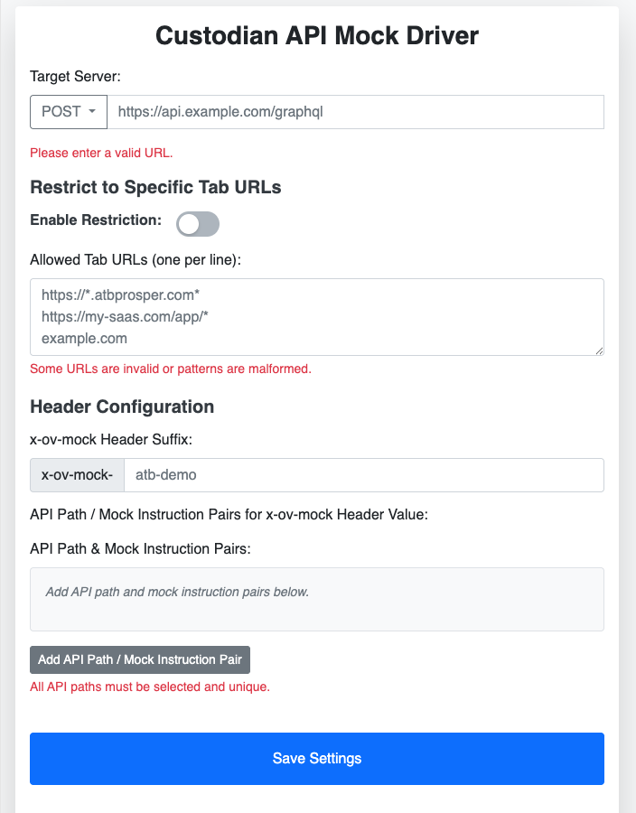

# Custodian API Mock Driver

A Chrome extension for **mocking custodian APIs during testing and demos** by injecting custom `x-ov-mock` headers into HTTP requests to GraphQL endpoints.



## Features

- **Custom Header Injection**: Injects configurable `x-ov-mock-{suffix}` headers into requests
- **API Path Dropdown**: Choose from predefined API paths or enter custom ones
- **HTTP Method Support**: Works with both POST and GET requests
- **URL Targeting**: Only affects requests to specified GraphQL server URLs
- **Tab Restrictions**: Optionally limit to specific browser tab URL patterns
- **Auto-formatting**: Converts user-friendly formats (e.g., `status=230` → `code=230`)

## Example

With suffix `atb-api` and API pairs:
- `dashboard/transactions/pac` → `status=230, dynamic=true`
- `dashboard/holdings` → `status=500, timeout=2s`

The injected header becomes:
```http
x-ov-mock-atb-api: dashboard/transactions/pac | Prefer code=230, dynamic=true ::: dashboard/holdings | Prefer code=500, timeout=2s
```

## Configuration

Configure the extension through its popup interface:

- **Target Server**: Specify the GraphQL endpoint URL and HTTP method (POST/GET)
- **Header Suffix**: Define the suffix for `x-ov-mock-{suffix}` headers
- **API Path Pairs**: Select API paths and provide mock instructions
- **Tab URL Restrictions**: Optionally limit to specific tab URL patterns

### Available API Paths

Common predefined paths include:
- Account management (`dashboard/account`, `dashboard/accounts`)
- Balance history (`dashboard/balanceHistory/account`, `dashboard/balanceHistory/client`)
- Banking (`dashboard/bankAccount`, `dashboard/beneficiaries`)
- Communications (`dashboard/CommunicationPreference`)
- Documents (`dashboard/documents`, `dashboard/documentNotifications`)
- Holdings (`dashboard/holdings`)
- Transactions (`dashboard/transactions`, `dashboard/transactions/pac`)
- User profiles (`profiles/user/roles`, `profiles/risk/answers`)

### Mock Instructions

Use user-friendly formats:
- **Status codes**: `status=230` (auto-converted to `code=230`)
- **Dynamic responses**: `dynamic=true`
- **Timeouts**: `timeout=5s`
- **Combined**: `status=201, dynamic=true, timeout=3s`

## Usage

The extension forwards requests to your GraphQL server with the mock header attached. Your infrastructure can then route matching requests to appropriate mock servers based on the header values.

## Contributing

Contributions welcome! Please open an issue or submit a pull request.